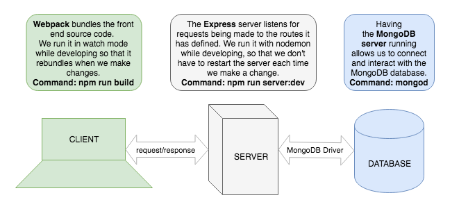

# Homework: Full Stack Games Hub App

### Learning Objectives

- Understand the relationship between client, server and database
- Be able to navigate a codebase that you haven't written

## Brief

Your boss has asked to you look over the codebase of a full-stack JavaScript application. The front-end is written in JavaScript using no frameworks, the back-end uses an Express server and a MongoDB database. Your task is to make yourself familiar with the codebase.

The application includes a README.md with instructions on running the application.

*Overview of the tech stack and tooling with commands*

## MVP

### Task

Draw a diagram showing the dataflow through the application starting with a form submission, ending with the re-rendering of the page. This will involve a multi-direction data-flow with the client posting data to the server and the server sending data back to the client with the response. Detail the client, server and database in the diagram and include the names of the files involved in the process.

### Questions

1. What is responsible for defining the routes of the `games` resource?
    The Express server

2. What are the the responsibilities of server.js?
    To indentify the request based on the info in the url and pass to the DB

3. What are the responsibilities of the `gamesRouter`?
    To send and receive the data to the DB from the server

4. What process does the the client (front-end) use to communicate with the server?
    They would use the form_view (browser) which would handle the communication

5. Which of the games API routes does the front-end application consume (i.e. make requests to)?

## Extensions

1. What are we using the [MongoDB Driver](http://mongodb.github.io/node-mongodb-native/) for?
2. Why do we need to use [`ObjectId`](https://mongodb.github.io/node-mongodb-native/api-bson-generated/objectid.html) from the MongoDB driver?
